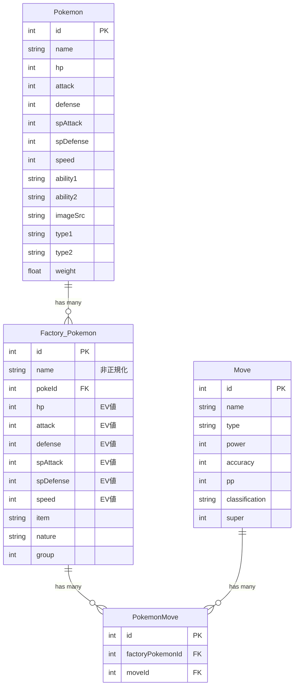

# SSG化実装プラン

## プロジェクト概要

Pokemon Battle Factory ダメージ計算機のpoke-search ページをSSG（Static Site Generation）化し、66,503行の定数ファイルをDBからのビルド時取得に置き換える。

## 実装状況（2026-01-31更新）

### ✅ Phase 0: JSON化（完了）

**当初の計画では直接DBからSSG化する予定でしたが、実装の過程で中間ステップとしてJSON化を先行実施しました。**

理由：
- JSONインポートの方がシンプルで実装が早い
- DBスキーマが未確定（将来的なカラム追加予定あり）
- 即座にバンドルサイズの改善効果を確認できる

実施内容：
1. ✅ TypeScript定数（66,503行）をJSONファイル（1.4MB）に変換
2. ✅ `public/data/factory-pokemons.json` に配置
3. ✅ `getStaticProps` でJSONファイルを読み込み
4. ✅ 全コンポーネントにprops経由でデータを伝播

結果：
- **バンドルサイズ削減**: index.js 289 kB → 205 kB (-84 KB)
- **バンドルサイズ削減**: poke-search.js 287 kB → 204 kB (-83 KB)
- **SSG化成功**: 両ページとも ● (SSG) マークで静的生成

### 🔄 Phase 1以降: DB直接取得（将来対応）

現在はJSON化で運用中。将来的にDBスキーマが確定したら、以下の移行を検討：
- `public/data/factory-pokemons.json` → Prismaクエリに置き換え
- データ更新時の自動反映（現在は手動JSON更新が必要）

## 現状分析

### ER図



### 正規化の問題点

#### 検出された問題

**`Factory_Pokemon.name`フィールドが冗長**
- `Pokemon.name`と重複
- 第二正規形（2NF）に違反
- データ不整合のリスク

#### 問題ではないもの

`Factory_Pokemon`のstats（hp, attack, defense, spAttack, spDefense, speed）は、base statsではなく**EV値（Effort Values）**を表しているため、意図的な設計。

- Base stats: `Pokemon`テーブルに格納
- EV values: `Factory_Pokemon`テーブルに格納（個体ごとの努力値振り）
- 計算式: 実際のステータス = f(base stats, EV, IV, nature)

### 現在のデータフロー

```
┌─────────────────────────────────────┐
│ FACTORY_POKEMONS 定数               │
│ (66,503行のハードコード)             │
└──────────────┬──────────────────────┘
               │ import
               ↓
┌─────────────────────────────────────┐
│ poke-search.tsx                     │
│ useState初期化                       │
└──────────────┬──────────────────────┘
               │
               ↓
┌─────────────────────────────────────┐
│ useMemoでクライアント側フィルタリング │
└──────────────┬──────────────────────┘
               │
               ↓
┌─────────────────────────────────────┐
│ ListPokemonCard レンダリング         │
└─────────────────────────────────────┘
```

### 現在使用されているファイル

1. **`src/constants/factoryPokemon.ts`** (66,503行)
   - 全ポケモンデータをハードコード
   - バンドルサイズ: 推定3-5MB

2. **`src/pages/poke-search.tsx`**
   - FACTORY_POKEMONSをインポート
   - useStateで管理

3. **`src/components/general/auto-complete.tsx`**
   - FACTORY_POKEMONSをインポート
   - ポケモン選択UIで使用

4. **`src/pages/api/factory_pokemon.ts`** (未使用)
   - Prismaでデータ取得するAPIエンドポイント
   - 実装済みだが呼び出されていない

## 提案するSSGデータフロー

```
┌─────────────────────────────────────┐
│ Build Time                          │
└─────────────────────────────────────┘
               │
               ↓
┌─────────────────────────────────────┐
│ PostgreSQL (Supabase)               │
└──────────────┬──────────────────────┘
               │ Prisma query
               ↓
┌─────────────────────────────────────┐
│ getStaticProps in poke-search.tsx   │
└──────────────┬──────────────────────┘
               │
               ↓
┌─────────────────────────────────────┐
│ Pre-rendered HTML + JSON props      │
│ (CDNにデプロイ)                      │
└─────────────────────────────────────┘

┌─────────────────────────────────────┐
│ Runtime                             │
└─────────────────────────────────────┘
               │
               ↓
┌─────────────────────────────────────┐
│ Static JSON instant load            │
└──────────────┬──────────────────────┘
               │
               ↓
┌─────────────────────────────────────┐
│ Client-side filtering/sorting       │
│ (useMemo - 現在と同じ)               │
└──────────────┬──────────────────────┘
               │
               ↓
┌─────────────────────────────────────┐
│ Render components                   │
└─────────────────────────────────────┘
```

## 実装内容

### ✅ 実装済み: JSON化 + SSG（Phase 0）

**実際に実装した内容（DB直接取得ではなくJSON経由）**

#### 変更ファイル一覧

1. **データ移行**
   - ✅ `src/constants/factoryPokemon.ts` → **削除**
   - ✅ `public/data/factory-pokemons.json` → **新規作成**（1.4MB）
   - ✅ `src/constants/index.ts` → factoryPokemons exportを削除

2. **SSG実装**
   - ✅ `src/pages/index.tsx` → getStaticPropsでJSON読み込み
   - ✅ `src/pages/poke-search.tsx` → getStaticPropsでJSON読み込み

3. **コンポーネント更新（props伝播）**
   - ✅ `src/components/general/auto-complete.tsx` → factoryPokemonsをpropsで受け取る
   - ✅ `src/components/general/pokemon-card.tsx` → factoryPokemonsをpropsで受け取る
   - ✅ `src/components/domain/attacker/attackers.tsx` → propsを子に渡す
   - ✅ `src/components/domain/attacker/attacker-reserve.tsx` → propsを受け取る
   - ✅ `src/components/domain/defender/defender-card.tsx` → propsを子に渡す
   - ✅ `src/components/domain/defender/defender-reserve.tsx` → propsを受け取る

4. **開発ツール**
   - ✅ `next.config.ts` → bundle analyzer設定追加
   - ✅ `.claude/plans/ssg-migration.md` → 詳細プラン作成

#### 実装コード例

**getStaticProps（JSON読み込み版）**

```typescript
import type { GetStaticProps } from "next";
import { promises as fs } from "node:fs";
import path from "node:path";

export const getStaticProps: GetStaticProps = async () => {
  const filePath = path.join(process.cwd(), "public/data/factory-pokemons.json");
  const fileContents = await fs.readFile(filePath, "utf8");
  const factoryPokemons = JSON.parse(fileContents);

  return {
    props: {
      factoryPokemons,
    },
  };
};
```

---

### 🔄 未実装: DB直接取得（Phase 1以降）

**当初計画していた実装（将来的に移行予定）**

#### 変更ファイル: `src/pages/poke-search.tsx`

**1. getStaticPropsの追加（DB版）**

```typescript
import prisma from "@/lib/prisma";
import type { GetStaticProps } from "next";

export const getStaticProps: GetStaticProps = async () => {
  const data = await prisma.factory_Pokemon.findMany({
    select: {
      id: true,
      hp: true,
      attack: true,
      defense: true,
      spAttack: true,
      spDefense: true,
      speed: true,
      item: true,
      nature: true,
      group: true,
      pokemon: true,
      moves: {
        select: {
          move: {
            select: {
              id: true,
              name: true,
              type: true,
              power: true,
              accuracy: true,
              pp: true,
              classification: true,
              super: true,
            },
          },
        },
      },
    },
  });

  const cleanedData = data.map((fp) => ({
    ...fp,
    moves: fp.moves.map((m) => m.move),
  }));

  return {
    props: {
      factoryPokemons: cleanedData,
    },
  };
};
```

**2. コンポーネントの修正**

```typescript
// 変更前
import { FACTORY_POKEMONS } from "@/constants/factoryPokemon";

export default function PokeSearch() {
  const [factoryPokemons] = useState<FactoryPokemon[]>(FACTORY_POKEMONS);
  // ...
}

// 変更後
interface PokeSearchProps {
  factoryPokemons: FactoryPokemon[];
}

export default function PokeSearch({ factoryPokemons }: PokeSearchProps) {
  // useStateは不要（propsを直接使用）
  // ...
}
```

**3. useMemoの更新**

```typescript
// 変更前
const filteredSortedFactoryPokemons = useMemo(() => {
  const filtered = factoryPokemons.filter(/* ... */);
  // ...
}, [factoryPokemons, level, times, item, ability, sortItem, selectedPokemon, isNejiki]);

// 変更後（同じだが、factoryPokemonsがpropsから来る）
const filteredSortedFactoryPokemons = useMemo(() => {
  const filtered = factoryPokemons.filter(/* ... */);
  // ...
}, [factoryPokemons, level, times, item, ability, sortItem, selectedPokemon, isNejiki]);
```

### Phase 2: auto-complete コンポーネント修正

#### 変更ファイル: `src/components/general/auto-complete.tsx`

**影響調査が必要**
- どこから呼び出されているか確認
- `index.tsx`（メインページ）で使用されている可能性

**修正方針**
- propsで`factoryPokemons`を受け取る
- FACTORY_POKEMONSインポートを削除

### Phase 3: クリーンアップ

#### 削除対象ファイル

1. **`src/constants/factoryPokemon.ts`**
   - 66,503行削除
   - バンドルサイズ3-5MB削減

2. **`src/pages/api/factory_pokemon.ts`**
   - 未使用のAPIエンドポイント削除
   - getStaticPropsで代替

## 期待される効果

### パフォーマンス改善

| 項目 | 変更前 | 変更後 | 改善 |
|------|--------|--------|------|
| JSバンドルサイズ | ~5MB | ~数百KB | **3-5MB削減** |
| 初回ロード時間 | 遅い（JSパース必要） | 高速（静的HTML） | **大幅改善** |
| 実行時DBクエリ | 0 | 0 | 変わらず |
| ビルド時DBクエリ | 0 | 1回 | +1回（許容範囲） |
| SEO | 良好 | さらに良好 | HTML内にデータ |

### その他のメリット

1. **CDNキャッシング**
   - 静的HTMLとしてCDN配信
   - グローバルで高速アクセス

2. **メンテナンス性向上**
   - データ更新時に定数ファイル編集不要
   - DBのみ更新して再ビルド

3. **型安全性**
   - Prismaの型を直接使用
   - 手動の型定義との不整合リスク削減

## リスク分析

### 潜在的リスク

#### 1. ビルド時のDB接続

**リスク**
- `DATABASE_URL`がビルド時に必要
- ビルド環境でDB接続できない場合、ビルド失敗

**対策**
- Vercel/Netlifyは環境変数を自動提供
- ローカルビルドには`.env`が必要
- CI/CDパイプラインに環境変数設定

#### 2. データの鮮度

**リスク**
- 静的生成後、DBが更新されても反映されない

**対策**
- ポケモンデータは基本的にREAD Only
- データ更新は稀（ゲームデータは固定）
- 必要に応じて手動で再ビルド
- ISR（Incremental Static Regeneration）も検討可能

#### 3. ビルド時間の増加

**リスク**
- DBクエリ分、ビルド時間が2-5秒増加

**対策**
- 許容範囲（ランタイムパフォーマンス向上とのトレードオフ）
- クエリは1回のみで高速

#### 4. 型の不一致

**リスク**
- Prismaの型と既存のカスタム型が異なる可能性

**対策**
- 既存のAPIエンドポイント（factory_pokemon.ts）と同じクエリを使用
- `cleanedData`で整形済み
- 既存の型定義（`FactoryPokemon`）と互換性あり

### エッジケース

#### 1. DBが空の場合

**挙動**
- 空配列が返る
- UI: "0件見つかりました"

**対応**
- 正常な挙動（問題なし）

#### 2. DB接続失敗

**挙動**
- ビルドエラー
- 明確なエラーメッセージ

**対応**
- ランタイムエラーより望ましい
- デプロイ前に検出可能

#### 3. リレーションが欠損

**挙動**
- Prismaがnullを返す可能性

**対応**
- DBの整合性制約で防止
- 必要に応じてnullチェック追加

## 実装スケジュール

### ✅ Phase 0: JSON化 + SSG実装（完了）

- [x] TypeScript定数をJSONに変換
- [x] `public/data/factory-pokemons.json`作成
- [x] `index.tsx`に`getStaticProps`追加
- [x] `poke-search.tsx`に`getStaticProps`追加
- [x] propsの型定義追加
- [x] `auto-complete.tsx`をpropsベースに変更
- [x] `pokemon-card.tsx`をpropsベースに変更
- [x] 全7コンポーネントの更新
- [x] `factoryPokemon.ts`削除
- [x] ビルド成功確認
- [x] バンドルサイズ検証

**実際の所要時間:** 約1.5時間（2026-01-31実施）

**成果:**
- バンドルサイズ: -84 KB (index), -83 KB (poke-search)
- SSG化完了: 両ページとも静的生成
- PR #31 作成・マージ完了

---

### 🔄 Phase 1: DB直接取得への移行（将来実施）

**前提条件:**
- DBスキーマが確定している
- 新規カラム追加が完了している

**実施内容:**
- [ ] `getStaticProps`をPrismaクエリに置き換え
- [ ] `public/data/factory-pokemons.json`削除
- [ ] データ更新時の自動反映確認

**推定時間:** 30分

---

### 🔄 Phase 2以降（オプション）

- [ ] `factory_pokemon.ts` API削除（現在未使用）
- [ ] パフォーマンステスト
- [ ] Lighthouse スコア測定

**推定時間:** 1時間

## テスト計画

### ビルドテスト

```bash
# ローカルビルド
npm run build

# 期待される結果
# - ビルド成功
# - .next/server/pages/poke-search.html 生成
# - .next/server/pages/poke-search.json 生成（props含む）
```

### 機能テスト

1. **フィルタリング**
   - ポケモン名検索
   - 周回数フィルタ
   - 特性フィルタ
   - アイテムフィルタ

2. **ソート**
   - HP/攻撃/防御/特攻/特防/素早さ

3. **レンダリング**
   - ポケモンカード表示
   - 画像読み込み
   - 技の詳細ポップオーバー

### パフォーマンステスト

```bash
# Lighthouseスコア測定
npx lighthouse https://nejiki-calculator.com/poke-search --view

# チェック項目
# - Performance score
# - First Contentful Paint
# - Largest Contentful Paint
# - Total Blocking Time
# - Cumulative Layout Shift
```

### バンドルサイズ検証

```bash
# ビルド後のバンドル分析
npm run build

# 期待される結果
# - pages/poke-search.js が大幅に縮小
# - FACTORY_POKEMONS定数が含まれていない
```

## ロールバック計画

万が一問題が発生した場合:

1. **即時対応**: Git revert
2. **FACTORY_POKEMONS復活**: 定数ファイルを一時的に復元
3. **段階的移行**: Phase 1のみ実装し、様子見

## 参考資料

- [Next.js SSG Documentation](https://nextjs.org/docs/basic-features/pages#static-generation-recommended)
- [Prisma Client API](https://www.prisma.io/docs/reference/api-reference/prisma-client-reference)
- [Vercel環境変数](https://vercel.com/docs/concepts/projects/environment-variables)

## 承認・実行

- **作成日**: 2026-01-31
- **承認者**: User
- **ステータス**: ✅ Phase 0完了（JSON化 + SSG）
- **実装日**: 2026-01-31
- **PR**: #31 (マージ済み)
- **次フェーズ**: DBスキーマ確定後にPhase 1実施予定
