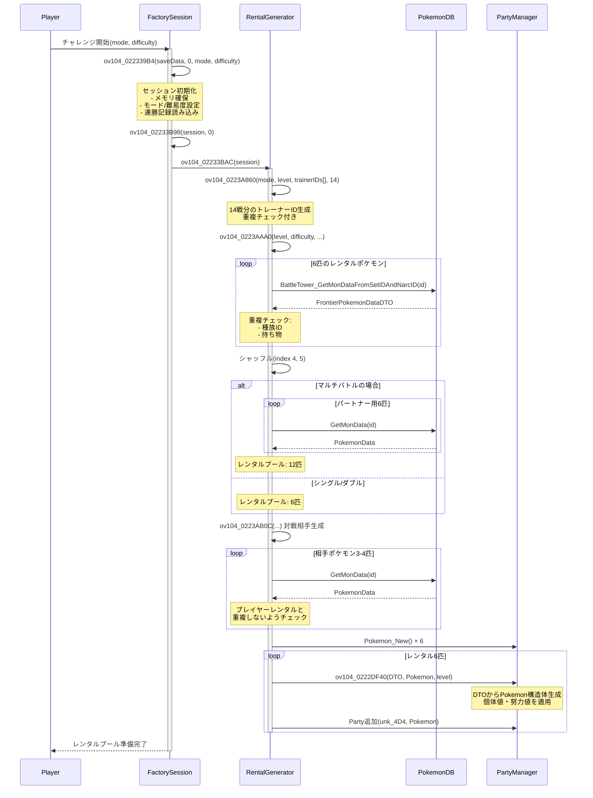
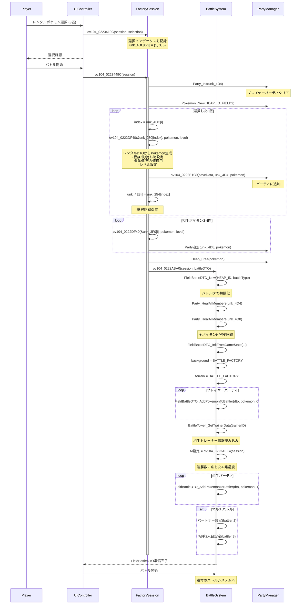
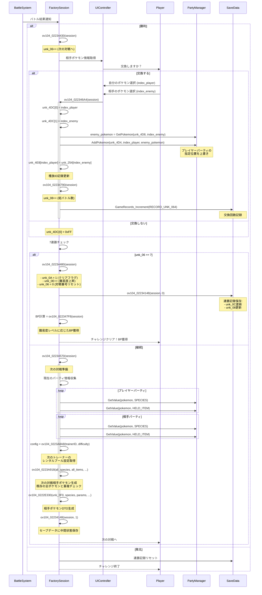
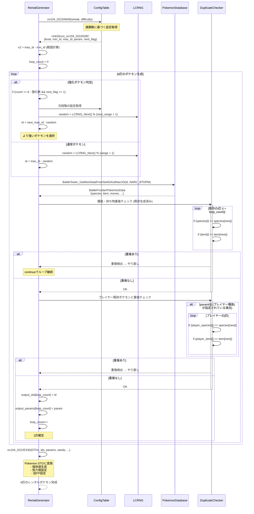

# バトルファクトリー バックエンドロジック解析レポート

## 目次
1. [概要](#概要)
2. [データ構造](#データ構造)
3. [コアロジック](#コアロジック)
4. [シーケンス図](#シーケンス図)
5. [個体値・能力値操作](#個体値能力値操作)
6. [ドメインルール詳細](#ドメインルール詳細)

---

## 概要

バトルファクトリーは、プレイヤーが自分のポケモンを預けてレンタルポケモンで戦う対戦施設です。本レポートでは、UI要素を除いたバックエンドロジック（ゲームルール、ポケモン生成、個体値操作、バトル管理）のみを抽出して解析します。

**主要実装ファイル:**
- `src/overlay104/ov104_0223A7F4.c` - レンタルポケモン生成・個体値操作
- `src/overlay104/ov104_022339B4.c` - チャレンジセッション管理
- `src/unk_0202D05C.c` - フロンティア共通機能（スコア計算、記録管理）

---

## データ構造

### 1. チャレンジセッション構造体 (`UnkStruct_ov104_0223ADA0`)

```c
typedef struct {
    int unk_00;                          // ヒープID (11 = HEAP_ID_FIELD2)
    u8 unk_04;                           // 施設モード (0=シングル, 1=ダブル, 3=マルチ)
    u8 unk_05;                           // 難易度 (0=Lv50制限, 1=オープンレベル)
    u8 unk_06;                           // 現在の対戦番号 (0-6)
    u16 unk_08;                          // 総バトル数カウンター
    u16 unk_0C;                          // 連勝記録 (現在の周回の勝利数)
    u16 unk_0E;                          // 難易度レベル (連勝数÷7で計算)

    u16 unk_18[14];                      // トレーナーID配列 (14戦分)

    // プレイヤーのレンタルプール
    u16 unk_254[6];                      // レンタルポケモンの種族ID
    u8 unk_260[6];                       // 能力値パラメータ
    u32 unk_268[6];                      // 性格値シード
    FrontierPokemonDataDTO unk_280[6];   // レンタルポケモン詳細データ

    // 対戦相手のポケモン
    u16 unk_3D2[4];                      // 相手ポケモンの種族ID
    u8 unk_3DA[4];                       // 相手の能力値パラメータ
    u32 unk_3E0[4];                      // 相手の性格値シード
    FrontierPokemonDataDTO unk_3F0[4];   // 相手ポケモン詳細データ

    // パーティ管理
    Party *unk_4D4;                      // プレイヤーの選択済みポケモンパーティ
    Party *unk_4D8;                      // 対戦相手のパーティ
    u16 unk_4DC[6];                      // 選択インデックス
    u16 unk_4E8[6];                      // 選択したポケモンの種族ID記録

    // マルチバトル用の追加レンタルプール
    u16 unk_584[6];                      // パートナー用レンタルポケモン種族ID
    u8 unk_590[6];                       // パートナー用能力値パラメータ
    u32 unk_598[6];                      // パートナー用性格値シード
    FrontierPokemonDataDTO unk_5B0[6];   // パートナー用レンタル詳細データ

    SaveData *saveData;                  // セーブデータへの参照
} UnkStruct_ov104_0223ADA0;
```

### 2. ポケモンデータ転送構造体 (`FrontierPokemonDataDTO`)

```c
typedef struct FrontierPokemonDataDTO {
    // 種族とフォルム (16bit)
    struct {
        u16 species : 11;    // 種族ID (0-2047)
        u16 form : 5;        // フォルムID (0-31)
    };

    u16 item;                // 持ち物ID
    u16 moves[4];            // 技ID配列

    u32 otID;                // 親トレーナーID
    u32 personality;         // 性格値 (性別・性格・色違い判定に使用)

    // 個体値 (5bit×6 = 30bit)
    union {
        struct {
            u32 hpIV : 5;       // HP個体値 (0-31)
            u32 atkIV : 5;      // 攻撃個体値 (0-31)
            u32 defIV : 5;      // 防御個体値 (0-31)
            u32 speedIV : 5;    // 素早さ個体値 (0-31)
            u32 spAtkIV : 5;    // 特攻個体値 (0-31)
            u32 spDefIV : 5;    // 特防個体値 (0-31)
        };
        u32 combinedIVs;        // ビットパック済み個体値
    };

    // 努力値 (8bit×6 = 48bit)
    union {
        struct {
            u8 hpEV;            // HP努力値 (0-255)
            u8 atkEV;           // 攻撃努力値
            u8 defEV;           // 防御努力値
            u8 speedEV;         // 素早さ努力値
            u8 spAtkEV;         // 特攻努力値
            u8 spDefEV;         // 特防努力値
        };
        u8 evList[6];           // 配列アクセス用
    };

    // PPアップ (2bit×4 = 8bit)
    union {
        struct {
            u8 move0PPUps : 2;  // 技1のPPアップ回数 (0-3)
            u8 move1PPUps : 2;  // 技2のPPアップ回数
            u8 move2PPUps : 2;  // 技3のPPアップ回数
            u8 move3PPUps : 2;  // 技4のPPアップ回数
        };
        u8 combinedPPUps;
    };

    u8 language;             // 言語ID
    u8 ability;              // 特性ID
    u8 friendship;           // なつき度
    u16 nickname[11];        // ニックネーム (UTF-16)
} FrontierPokemonDataDTO;
```

### 3. レンタルプール設定構造体 (`UnkStruct_ov104_0224028C`)

```c
typedef struct {
    u16 unk_00;    // レベル閾値
    u16 unk_02;    // データベース開始インデックス (最小ID)
    u16 unk_04;    // データベース終了インデックス (最大ID)
    u8 unk_06;     // 能力値パラメータ
    u8 unk_07;     // 次段階へのフラグ (1=次のテーブルを参照可能)
} UnkStruct_ov104_0224028C;
```

---

## コアロジック

### 1. チャレンジ初期化 (`ov104_022339B4`)

**関数:** `UnkStruct_ov104_0223ADA0 *ov104_022339B4(SaveData *saveData, u16 param1, u8 param2, u8 param3)`

**処理フロー:**
```c
// Lines 52-117
1. メモリ確保 (sizeof(UnkStruct_ov104_0223ADA0))
2. ゼロクリア
3. セーブデータ参照を保存
4. パーティオブジェクト作成 (unk_4D4, unk_4D8)

if (param1 == 0) {  // 新規チャレンジ
    5a. モード設定 (param2 → unk_04)
    5b. 難易度設定 (param3 → unk_05)
    5c. 対戦番号初期化 (unk_06 = 0)
    5d. セッションクリア
    5e. 既存の連勝記録を読み込み (unk_0C, unk_08)
} else {  // 継続チャレンジ
    6a. セーブデータからモード・難易度・対戦番号を復元
    6b. 連勝記録を復元
}

7. 難易度レベル計算 (unk_0E = unk_0C / 7)
8. マルチバトルの場合、通信初期化

return チャレンジセッション構造体
```

**パラメータ:**
- `param1`: 0=新規, 1=継続
- `param2`: 施設モード (0=シングル, 1=ダブル, 3=マルチ)
- `param3`: 難易度 (0=Lv50制限, 1=オープンレベル)

---

### 2. レンタルポケモン生成 (`ov104_02233BAC`)

**関数:** `static void ov104_02233BAC(UnkStruct_ov104_0223ADA0 *param0)`

**処理フロー:**
```c
// Lines 130-183
1. トレーナーID配列生成 (14戦分)
   ov104_0223A860() → 重複なしランダム選択

2. プレイヤーのレンタルポケモン6匹生成
   ov104_0223AAA0() → 種族・能力値・技を決定

3. シャッフル処理 (インデックス4, 5)
   ランダムな位置と交換して選択肢を分散

4. マルチバトルの場合:
   4a. パートナー用レンタル6匹生成
   4b. シャッフル処理
   4c. 総レンタル数を12匹に拡張

5. 対戦相手のポケモン生成
   ov104_0223AB0C() → 既存レンタルと重複しない種族・持ち物

6. ポケモンオブジェクト化
   Pokemon構造体に変換してパーティ (unk_4D4) に追加
```

**重要なアルゴリズム:**

#### トレーナーID重複排除 (`ov104_0223A860`)
```c
// Lines 124-144 (ov104_0223A7F4.c)
void ov104_0223A860(u8 param0, int param1, u16 param2[], u8 param3) {
    int v0 = 0;
    do {
        // ランダムなトレーナーIDを生成
        param2[v0] = ov104_0223A7F4(param0, param1, v0);

        // 既存のIDと重複チェック
        for (v1 = 0; v1 < v0; v1++) {
            if (param2[v1] == param2[v0]) {
                break;  // 重複発見 → やり直し
            }
        }

        if (v1 != v0) {
            continue;  // 重複があったのでループ継続
        }

        v0++;  // 重複なし → 次のIDへ
    } while (v0 < param3);
}
```

---

### 3. ポケモンID計算 (`ov104_0223A7F4`)

**関数:** `static int ov104_0223A7F4(u8 param0, int param1, int param2)`

**ロジック:**
```c
// Lines 94-122 (ov104_0223A7F4.c)
// 能力値テーブル: Unk_ov104_022401FC[8]
// 各エントリ: {min_base, max_base, min_strong, max_strong}

1. 難易度レベルのクランプ (最大7)
   if (param1 >= 8) param1 = 7;

2. 施設長戦の特殊処理
   if (param0 == 0 && 連勝数 == 21) return 309;  // トウガン(シングル)
   if (param0 == 0 && 連勝数 == 49) return 310;  // トウガン(施設長)

3. 対戦番号による能力値範囲選択
   if (対戦番号 == 6 || 対戦番号 == 13) {
       // 7戦目と14戦目は強化版
       range = unk_04 - unk_06;
       base = unk_04;
   } else {
       // 通常戦
       range = unk_02 - unk_00;
       base = unk_00;
   }

4. LCRNGによるランダム選択
   result = base + (LCRNG_Next() % range);
   return result;
```

**能力値テーブル例 (Unk_ov104_022401FC):**
```c
// Lines 29-38
// {min_base, max_base, min_strong, max_strong}
{ 0x00, 0x63, 0x64, 0x77 },  // Lv0: 0-99 (base), 100-119 (strong)
{ 0x50, 0x77, 0x78, 0x8B },  // Lv1: 80-119, 120-139
{ 0x64, 0x8B, 0x8C, 0x9F },  // Lv2: 100-139, 140-159
...
{ 0xC8, 0x12B, 0xC8, 0x12B }  // Lv7: 200-299 (固定範囲)
```

---

### 4. レンタルプール設定選択 (`ov104_0223A8A8`)

**関数:** `const UnkStruct_ov104_0224028C *ov104_0223A8A8(int param0, int param1)`

**ロジック:**
```c
// Lines 146-172 (ov104_0223A7F4.c)
1. 難易度によるテーブル選択
   if (param1 == 0) {
       table = Unk_ov104_0224028C;       // Lv50制限
   } else {
       table = Unk_ov104_022402DC;       // オープンレベル (マルチ)
   }

2. 連勝数に基づく設定検索
   for (v0 = 0; v0 < table_size; v0++) {
       if (param0 < table[v0].unk_00) {
           break;  // 閾値を超えた → このエントリを使用
       }
   }

3. 範囲外チェック
   if (v0 >= table_size) {
       v0 = table_size - 1;  // 最大値に制限
   }

return &table[v0];
```

**Lv50制限テーブル (Unk_ov104_0224028C):**
```c
// Lines 40-51
// {レベル閾値, 最小ID, 最大ID, 能力値param, 次段階フラグ}
{ 0x64,  0x001, 0x096, 0x00, 0x1 },  // 100連勝未満: ID 1-150
{ 0x78,  0x097, 0x0FA, 0x04, 0x1 },  // 120連勝未満: ID 151-250
{ 0x8C,  0x0FB, 0x15E, 0x08, 0x1 },  // 140連勝未満: ID 251-350
{ 0xA0,  0x15F, 0x1E6, 0x0C, 0x1 },  // 160連勝未満: ID 351-486
{ 0xB4,  0x1E7, 0x26E, 0x10, 0x1 },  // 180連勝未満: ID 487-622
{ 0xC8,  0x26F, 0x2F6, 0x14, 0x1 },  // 200連勝未満: ID 623-758
{ 0xDC,  0x2F7, 0x37E, 0x18, 0x1 },  // 220連勝未満: ID 759-894
{ 0x12C, 0x15F, 0x3B6, 0x1F, 0x0 },  // 300連勝以上: ID 351-950 (最強)
{ 0x136, 0x15F, 0x1E6, 0x0C, 0x0 },  // 特殊モード1
{ 0x137, 0x15F, 0x1E6, 0x1F, 0x0 },  // 特殊モード2
```

---

### 5. 対戦相手ポケモン生成 (`ov104_0223A918`)

**関数:** `BOOL ov104_0223A918(...)`

**パラメータ:**
- `param0[]`: プレイヤーの種族ID配列
- `param1[]`: プレイヤーの持ち物ID配列
- `param2`: プレイヤーのポケモン数
- `param3`: 生成する相手ポケモン数
- `param4[]`: 出力用の種族ID配列
- `param6`: レンタルプール設定
- `param7`: 連勝数 (強化判定用)

**処理フロー:**
```c
// Lines 195-259 (ov104_0223A7F4.c)
1. 連勝数による強化判定
   if (param7 != 0) {
       // 連勝数に応じて強化ポケモンを混入
       // 6, 13, 20, 27, 34連勝で段階的に増加
       強化匹数 = lookup_table[連勝数範囲];
   }

2. ポケモン生成ループ (param3匹分)
   while (v1 != param3) {
       2a. 強化判定
           if (v1 >= param3 - 強化匹数 && next_table_available) {
               // 次段階のテーブルから選択
               id = (next_table.max_id) - (LCRNG_Next() % range);
           } else {
               // 通常テーブルから選択
               id = (current_table.max_id) - (LCRNG_Next() % range);
           }

       2b. データベースから読み込み
           BattleTower_GetMonDataFromSetIDAndNarcID(&v4[v1], id, NARC_PL_BTDPM);

       2c. 重複チェック (既存の相手ポケモン内)
           for (v5 = 0; v5 < v1; v5++) {
               if (種族重複 || 持ち物重複) break;
           }
           if (重複あり) continue;

       2d. 重複チェック (プレイヤーのポケモンとの比較)
           for (v5 = 0; v5 < param2; v5++) {
               if (種族重複 || 持ち物重複) break;
           }
           if (重複あり) continue;

       2e. 採用
           param4[v1] = id;
           v1++;
   }
```

**強化ポケモン混入テーブル:**
```c
// Lines 187-193
static const int Unk_ov104_022401E8[] = {
    0x6,   // ~6連勝
    0xD,   // ~13連勝
    0x14,  // ~20連勝
    0x1B,  // ~27連勝
    0x22   // ~34連勝
};
// 例: 15連勝の場合 → v6 = 1 → 相手の1匹が次段階テーブルから選出
```

---

### 6. バトル準備 (`ov104_0223449C`)

**関数:** `void ov104_0223449C(UnkStruct_ov104_0223ADA0 *param0)`

**処理フロー:**
```c
// Lines 465-493 (ov104_022339B4.c)
1. パーティ数取得
   player_count = ov104_0223AA50(param0->unk_04);  // 3 or 2
   enemy_count = ov104_0223AA74(param0->unk_04, 1);  // 3, 2, or 4

2. プレイヤーパーティ初期化
   Party_Init(param0->unk_4D4);

3. 選択されたレンタルポケモンを追加
   Pokemon *v3 = Pokemon_New(HEAP_ID_FIELD2);
   for (v0 = 0; v0 < player_count; v0++) {
       // param0->unk_4DC[v0] = 選択されたインデックス
       index = param0->unk_4DC[v0];

       // レンタルデータからPokemon構造体を生成
       ov104_0222DF40(&param0->unk_280[index], v3, level);

       // パーティに追加
       ov104_0222E1C0(saveData, param0->unk_4D4, v3);

       // 選択記録を保存
       param0->unk_4E8[v0] = param0->unk_254[index];
   }

4. 相手ポケモンをパーティに追加
   for (v0 = 0; v0 < enemy_count; v0++) {
       ov104_0222DF40(&param0->unk_3F0[v0], v3, level);
       ov104_0222E1C0(saveData, param0->unk_4D8, v3);
   }

5. メモリ解放
   Heap_Free(v3);
```

---

### 7. ポケモン交換処理 (`ov104_022346A4`)

**関数:** `void ov104_022346A4(UnkStruct_ov104_0223ADA0 *param0)`

**ロジック:**
```c
// Lines 537-554 (ov104_022339B4.c)
1. 交換フラグチェック
   if (param0->unk_4DC[0] == 0xFF) {
       // 交換なし → 処理終了
       return;
   }

2. 相手のポケモンを取得
   Pokemon *v0 = Party_GetPokemonBySlotIndex(
       param0->unk_4D8,      // 相手パーティ
       param0->unk_4DC[1]    // 相手ポケモンのインデックス
   );

3. プレイヤーパーティの指定位置に追加
   Party_AddPokemonBySlotIndex(
       param0->unk_4D4,      // プレイヤーパーティ
       param0->unk_4DC[0],   // 交換先インデックス
       v0                    // 交換するポケモン
   );

4. 種族ID記録を更新
   param0->unk_4E8[param0->unk_4DC[0]] =
       param0->unk_254[param0->unk_4DC[1]];

5. 統計更新
   ov104_02234790(param0);  // 総バトル数+1
   GameRecords_IncrementRecordValue(RECORD_UNK_064);  // 交換回数記録
```

---

### 8. 次の対戦準備 (`ov104_02234570`)

**関数:** `void ov104_02234570(UnkStruct_ov104_0223ADA0 *param0)`

**処理フロー:**
```c
// Lines 495-535 (ov104_022339B4.c)
1. 現在のパーティ情報を収集
   player_party_count = Party_GetCurrentCount(param0->unk_4D4);

   for (v0 = 0; v0 < player_party_count; v0++) {
       Pokemon *v6 = Party_GetPokemonBySlotIndex(unk_4D4, v0);
       v4[v0] = Pokemon_GetValue(v6, MON_DATA_SPECIES);
       v5[v0] = Pokemon_GetValue(v6, MON_DATA_HELD_ITEM);
   }

2. 相手パーティ情報も収集
   enemy_party_count = Party_GetCurrentCount(param0->unk_4D8);

   for (v0 = 0; v0 < enemy_party_count; v0++) {
       v4[v0 + player_count] = 相手の種族ID;
       v5[v0 + player_count] = 相手の持ち物ID;

       // 相手の種族IDをプレイヤーのレンタルプールに記録
       param0->unk_254[v0] = param0->unk_3D2[v0];
   }

3. 次の相手ポケモン生成
   config = ov104_0223A8A8(
       param0->unk_18[param0->unk_06],  // 次のトレーナーID
       param0->unk_05                    // 難易度
   );

   ov104_0223A918(
       v4,                               // 全ポケモンの種族ID
       v5,                               // 全ポケモンの持ち物ID
       (player_count + enemy_count),     // 重複チェック対象数
       enemy_count,                      // 生成する相手数
       param0->unk_3D2,                  // 出力先
       config,                           // レンタルプール設定
       0,                                // 強化フラグ
       param0->unk_3DA                   // 能力値パラメータ出力
   );

4. ポケモンデータ生成
   ov104_0222E330(
       param0->unk_3F0,      // 出力先
       param0->unk_3D2,      // 種族ID
       param0->unk_3DA,      // 能力値パラメータ
       NULL,
       param0->unk_3E0,      // 性格値出力
       enemy_count,
       11,                   // ヒープID
       179                   // NARC ID
   );
```

---

### 9. 勝利処理 (`ov104_02234480`)

**関数:** `void ov104_02234480(UnkStruct_ov104_0223ADA0 *param0)`

**ロジック:**
```c
// Lines 451-463 (ov104_022339B4.c)
1. クリアフラグ設定
   param0->unk_0A = 1;

2. 難易度レベル上昇
   if (param0->unk_0E < 8) {
       param0->unk_0E++;  // 最大レベル8
   }

3. 対戦番号リセット
   param0->unk_06 = 0;

4. セーブデータに記録
   ov104_02234148(param0, 0);
```

---

### 10. AI難易度計算 (`ov104_0223AEE4`)

**関数:** `static u16 ov104_0223AEE4(UnkStruct_ov104_0223ADA0 *param0)`

**ロジック:**
```c
// Lines 489-514 (ov104_0223A7F4.c)
1. 施設長戦チェック
   if (mode == シングル && (trainerID == 309 || trainerID == 310)) {
       return 0x1 | 0x2 | 0x4;  // AI_FLAG_BASIC | CHECK_BAD_MOVE | TRY_TO_FAINT
   }

2. 連勝数取得
   streak = ov104_0223AF34(param0);  // マルチの場合はパートナーの記録も考慮

3. 連勝数によるAIレベル設定
   ai_mask = 0x1 | 0x2 | 0x4;  // デフォルト: 全フラグON

   switch (streak + 1) {
       case 1:
       case 2:
           ai_mask = 0;          // 1-2連勝: AIなし
           break;
       case 3:
       case 4:
           ai_mask = 0x1;        // 3-4連勝: 基本AI
           break;
       // case 5以降: フルAI (0x1 | 0x2 | 0x4)
   }

   return ai_mask;
```

**AIフラグの意味:**
- `0x1`: 基本的な技選択
- `0x2`: 効果の薄い技を避ける
- `0x4`: 相手を倒せる技を優先

---

### 11. BP計算 (`ov104_022347F8`)

**関数:** `u16 ov104_022347F8(UnkStruct_ov104_0223ADA0 *param0)`

**ロジック:**
```c
// Lines 624-654 (ov104_022339B4.c)
static const u8 single_bp_table[9] = { 0, 5, 5, 5, 5, 7, 7, 8, 9 };
static const u8 multi_bp_table[9] = { 0, 10, 11, 12, 13, 16, 17, 19, 21 };

1. 難易度レベル取得
   level = param0->unk_0E;  // 0-8

2. モード判定
   if (mode == シングル || mode == ダブル) {
       bp = single_bp_table[level];
   } else {
       bp = multi_bp_table[level];
   }

3. 施設長戦ボーナス
   if (mode == シングル && (streak == 21 || streak == 49)) {
       bp = 20;
   }

   return bp;
```

**BP獲得テーブル:**
| 難易度Lv | シングル/ダブル | マルチ |
|----------|-----------------|--------|
| 0        | 0 BP            | 0 BP   |
| 1        | 5 BP            | 10 BP  |
| 2        | 5 BP            | 11 BP  |
| 3        | 5 BP            | 12 BP  |
| 4        | 5 BP            | 13 BP  |
| 5        | 7 BP            | 16 BP  |
| 6        | 7 BP            | 17 BP  |
| 7        | 8 BP            | 19 BP  |
| 8+       | 9 BP            | 21 BP  |

---

## シーケンス図

### 1. チャレンジ開始フロー



---

### 2. ポケモン選択〜バトル開始フロー



---

### 3. バトル終了〜ポケモン交換フロー



---

### 4. レンタルポケモン生成詳細フロー



---

## 個体値・能力値操作

### 1. 個体値生成ロジック

バトルファクトリーでは、個体値はデータベースに事前定義された値を使用します。カスタム生成ではなく、固定されたポケモンセット（NARC `pl_btdpm.narc`）から読み込みます。

**データベース読み込み:**
```c
// Lines 230 (ov104_0223A7F4.c)
BattleTower_GetMonDataFromSetIDAndNarcID(
    &v4[v1],                          // 出力先
    v3,                               // セットID (連勝数から計算)
    NARC_INDEX_BATTLE__B_PL_TOWER__PL_BTDPM  // データベース
);
```

**FrontierPokemonDataDTO内の個体値:**
```c
// Lines 28-39 (frontier_data_transfer.h)
union {
    struct {
        u32 hpIV : 5;       // 0-31
        u32 atkIV : 5;      // 0-31
        u32 defIV : 5;      // 0-31
        u32 speedIV : 5;    // 0-31
        u32 spAtkIV : 5;    // 0-31
        u32 spDefIV : 5;    // 0-31
        u32 unk_14_val1_30 : 1;
        u32 : 1;
    };
    u32 combinedIVs;        // ビットパック形式
};
```

**個体値の範囲:**
- 各ステータス: 0-31 (5bit)
- データベース内で事前に設定済み
- 連勝数が高いほど高個体値のポケモンが選出される傾向

---

### 2. 努力値設定

努力値もデータベースに事前定義されています。

```c
// Lines 40-50 (frontier_data_transfer.h)
union {
    struct {
        u8 hpEV;       // HP努力値 (0-255)
        u8 atkEV;      // 攻撃努力値
        u8 defEV;      // 防御努力値
        u8 speedEV;    // 素早さ努力値
        u8 spAtkEV;    // 特攻努力値
        u8 spDefEV;    // 特防努力値
    };
    u8 evList[6];      // 配列形式アクセス
};
```

**努力値合計ルール:**
- 各ステータス最大: 255
- 総合計: 通常は510 (データベース設定による)
- フロンティア施設では最適化された配分が事前設定

---

### 3. レベル設定

**関数:** `u8 ov104_0223ADA0(UnkStruct_ov104_0223ADA0 *param0)`

```c
// Lines 423-430 (ov104_0223A7F4.c)
u8 ov104_0223ADA0(UnkStruct_ov104_0223ADA0 *param0) {
    if (param0->unk_05 == 0) {  // Lv50制限
        return 50;
    } else {                     // オープンレベル
        return 100;
    }
}
```

**レベルの影響:**
- Lv50制限: 全ポケモンがレベル50に統一
- オープンレベル: 全ポケモンがレベル100に統一
- 技構成はレベルにより異なる（データベース依存）

---

### 4. 性格値 (Personality Value)

性格値は性格・性別・色違い判定に使用されます。

```c
// Lines 26 (frontier_data_transfer.h)
u32 personality;
```

**性格値の用途:**
1. **性格決定:** `personality % 25` → 25種類の性格
2. **性別判定:** `(personality & 0xFF)` と種族の性別比率を比較
3. **色違い判定:** `personality` と `otID` のXOR演算

データベースに保存された値を使用するため、カスタム生成はありません。

---

### 5. Pokemon構造体への変換

**関数:** `ov104_0222DF40(&FrontierPokemonDataDTO, Pokemon*, level)`

DTOからゲーム内Pokemon構造体に変換する際の処理:
```c
// 実装は別ファイル (ov104_0222DCE0.c と推測)
1. Pokemon_Init(pokemon, species, level, ...)
2. Pokemon_SetValue(pokemon, MON_DATA_PERSONALITY, personality)
3. Pokemon_SetValue(pokemon, MON_DATA_HP_IV, hpIV)
4. Pokemon_SetValue(pokemon, MON_DATA_ATK_IV, atkIV)
   ... (全ステータスのIV設定)
5. Pokemon_SetValue(pokemon, MON_DATA_HP_EV, hpEV)
   ... (全ステータスのEV設定)
6. Pokemon_SetValue(pokemon, MON_DATA_HELD_ITEM, item)
7. for (i = 0; i < 4; i++) {
       Pokemon_SetValue(pokemon, MON_DATA_MOVE1 + i, moves[i])
       Pokemon_SetValue(pokemon, MON_DATA_MOVE1_PP_UPS + i, ppUps[i])
   }
8. Pokemon_SetValue(pokemon, MON_DATA_ABILITY, ability)
9. Pokemon_SetValue(pokemon, MON_DATA_FRIENDSHIP, friendship)
10. Pokemon_CalcLevelAndStats(pokemon)  // 実数値計算
```

**実数値計算式 (参考):**
```
HP = floor((2 × BaseHP + IV + EV/4) × Level / 100) + Level + 10
その他 = floor(((2 × BaseStat + IV + EV/4) × Level / 100) + 5) × 性格補正
```

---

### 6. LCRNG (Linear Congruential Random Number Generator)

**使用箇所:**
- トレーナーID選択
- ポケモン種族選択
- シャッフル処理

**アルゴリズム:**
```c
// 標準的なLCRNG実装 (推定)
seed = (seed × 0x41C64E6D + 0x6073) & 0xFFFFFFFF;
return (seed >> 16) & 0x7FFF;
```

**乱数の使用例:**
```c
// Lines 120 (ov104_0223A7F4.c)
v0 = base + (LCRNG_Next() % range);

// Lines 193 (ov104_022339B4.c)
v0 = (LCRNG_Next() % 6);  // 0-5のランダムインデックス
```

---

## ドメインルール詳細

### 1. 施設モード定義

| モード値 | 名称 | プレイヤー数 | 相手数 | バトル形式 |
|---------|------|-------------|--------|----------|
| 0 | シングルバトル | 3匹 | 3匹 | 1vs1 |
| 1 | ダブルバトル | 4匹 | 4匹 | 2vs2 |
| 2 | (未使用) | - | - | - |
| 3 | マルチバトル | 2匹×2人 | 2匹×2人 | 2vs2 (協力) |

**取得関数:**
```c
// Lines 261-273 (ov104_0223A7F4.c)
u8 ov104_0223AA50(u8 param0) {  // プレイヤー側の数
    switch (param0) {
        case 0:
        case 1:
            return 3;  // シングル・ダブルは3匹選択
        case 2:
        case 3:
            return 2;  // マルチは2匹選択
    }
    return 0;
}

// Lines 275-291
u8 ov104_0223AA74(u8 param0, BOOL param1) {  // バトル参加数
    switch (param0) {
        case 0:
        case 1:
            return 3;  // シングル・ダブル: 3匹
        case 2:
        case 3:
            if (param1 == 0) {
                return 2;  // マルチ (表示用): 2匹
            } else {
                return 4;  // マルチ (実際): 4匹 (パートナー含む)
            }
    }
    return 0;
}
```

---

### 2. 難易度レベルの進行

```c
// Lines 110 (ov104_022339B4.c)
unk_0E = unk_0C / 7;  // 難易度レベル = 連勝数 ÷ 7
```

| 連勝数範囲 | 難易度レベル | 特徴 |
|-----------|-------------|------|
| 0-6 | 0 | 最弱のポケモンプール |
| 7-13 | 1 | やや強化 |
| 14-20 | 2 | 中級 |
| 21-27 | 3 | 上級 |
| 28-34 | 4 | 強化 |
| 35-41 | 5 | 最上級 |
| 42-48 | 6 | 超上級 |
| 49-55 | 7 | 最強 |
| 56+ | 8 (上限) | 最強固定 |

**難易度レベルの影響:**
1. レンタルプール設定 (`Unk_ov104_0224028C`)
2. 対戦相手の強さ
3. AI難易度
4. BP獲得量

---

### 3. 連勝記録管理

**連勝カウンター:**
```c
u16 unk_0C;    // 現在のチャレンジの連勝数 (0-9999)
u16 unk_08;    // 総バトル数 (全チャレンジ通算)
u8 unk_06;     // 現在の対戦番号 (0-6)
```

**連勝記録の更新:**
```c
// Lines 451-463 (ov104_022339B4.c)
void ov104_02234480(UnkStruct_ov104_0223ADA0 *param0) {
    param0->unk_0A = 1;  // クリアフラグ

    if (param0->unk_0E < 8) {
        param0->unk_0E++;  // 難易度レベル+1
    }

    param0->unk_06 = 0;  // 対戦番号リセット
    ov104_02234148(param0, 0);  // セーブデータに記録
}
```

**総バトル数の更新:**
```c
// Lines 584-591 (ov104_022339B4.c)
void ov104_02234790(UnkStruct_ov104_0223ADA0 *param0) {
    if (param0->unk_08 < 9999) {
        param0->unk_08++;  // 最大9999でキャップ
    }
}
```

---

### 4. 重複排除ルール

**レンタルプール生成時:**
1. 同じ種族のポケモンは1匹のみ
2. 同じ持ち物のポケモンは1匹のみ
3. プレイヤーが既に持っているポケモンと被らない

**対戦相手生成時:**
1. 相手チーム内で種族・持ち物が重複しない
2. プレイヤーのレンタルポケモンと種族・持ち物が重複しない
3. 前回の対戦相手とも重複しない（セッション内）

**実装:**
```c
// Lines 232-250 (ov104_0223A7F4.c)
for (v5 = 0; v5 < v1; v5++) {
    if ((v4[v5].species == v4[v1].species) ||
        (v4[v5].item == v4[v1].item)) {
        break;  // 重複検出 → やり直し
    }
}

if (v5 != v1) {
    continue;  // ループ継続
}

for (v5 = 0; v5 < param2; v5++) {
    if ((v4[v1].species == param0[v5]) ||
        (v4[v1].item == param1[v5])) {
        break;  // プレイヤーと重複 → やり直し
    }
}
```

---

### 5. トレーナーID生成

**14戦分のトレーナーID配列:**
```c
u16 unk_18[14];  // 7戦 × 2セット
```

**生成アルゴリズム:**
```c
// Lines 124-144 (ov104_0223A7F4.c)
do {
    // ランダムID生成
    id = ov104_0223A7F4(mode, difficulty_level, battle_index);

    // 重複チェック
    for (i = 0; i < current_count; i++) {
        if (ids[i] == id) break;
    }

    if (重複なし) {
        ids[current_count] = id;
        current_count++;
    }
} while (current_count < 14);
```

**特殊トレーナー:**
```c
// Lines 105-109 (ov104_0223A7F4.c)
if (mode == シングル) {
    if (total_battles == 21) return 309;  // トウガン (7連勝×3周目)
    if (total_battles == 49) return 310;  // トウガン最強版
}
```

---

### 6. スコア計算システム

**関数:** `u16 sub_0202D334(UnkStruct_0202D750 *param0, UnkStruct_0202D060 *param1)`

```c
// Lines 249-274 (unk_0202D05C.c)
u16 sub_0202D334(UnkStruct_0202D750 *param0, UnkStruct_0202D060 *param1) {
    u16 v0, v1, v2, v3, v4;
    u16 score = 0;

    // 基礎点: (難易度 - 1) × 1000
    v0 = (param1->unk_02 - 1) * 1000;

    // 連勝ボーナス: 連勝数 × 10
    v1 = param1->unk_04 * 10;

    // レベルオフセットボーナス: レベル差 × 20
    v2 = param1->unk_03 * 20;

    // 中間計算: 950 - (連勝ボーナス + レベルボーナス)
    if (v1 + v2 > 950) {
        v4 = 0;
    } else {
        v4 = 950 - (v1 + v2);
    }

    // 特性バリエーションボーナス: (1000 - 特性数) ÷ 30
    if (param1->unk_06 > (1000 - 30)) {
        v3 = 0;
    } else {
        v3 = (1000 - param1->unk_06) / 30;
    }

    // 合計スコア
    score = v0 + v4 + v3;
    param0->unk_16 = score;

    return score;
}
```

**スコア計算式:**
```
score = 基礎点 + (950 - 連勝点 - レベル点) + 特性点

基礎点 = (難易度 - 1) × 1000
連勝点 = 連勝数 × 10
レベル点 = レベルオフセット × 20
特性点 = (1000 - 使用特性数) ÷ 30
```

**スコア例:**
- 難易度2, 10連勝, レベル差3, 特性30種類使用
  - 基礎点: 1 × 1000 = 1000
  - 中間値: 950 - (10×10 + 3×20) = 950 - 160 = 790
  - 特性点: (1000 - 30) / 30 = 32
  - **合計: 1822点**

---

### 7. バトルビデオ記録

**データ構造:**
```c
// Lines 1-21 (struct_0202D764.h)
typedef struct UnkStruct_0202D764_t {
    u32 unk_00;              // 最終プレイ日時 (エンコード済み)
    u8 unk_04[250];          // ビット配列 (2000ビデオ分)
    u8 unk_FE;               // シングル/ダブルビデオフラグ
    u8 unk_FF;               // マルチビデオフラグ
    u8 unk_100;              // ビデオパラメータ1
    u8 unk_101;              // ビデオパラメータ2
    u8 unk_102;              // マルチパラメータ1
    u8 unk_103;              // マルチパラメータ2
    UnkStruct_0202D63C unk_104[7];  // 保存済みトレーナー記録
    UnkStruct_ov90_021D1750 unk_740[30];  // マルチバトル記録
} UnkStruct_0202D764;
```

**ビデオ記録設定:**
```c
// Lines 434-463 (unk_0202D05C.c)
BOOL sub_0202D558(UnkStruct_0202D764 *param0, u8 level, u8 battle_num, RTCDate *date) {
    // 日付チェック
    Date_Decode(param0->unk_00, &old_date);
    if (date > old_date) {
        sub_0202D514(param0);  // 古い記録をクリア
        return 0;
    }

    // ビット位置計算: (level - 1) × 200 + (battle_num - 1)
    bit_index = (level - 1) * 200 + (battle_num - 1);
    byte_index = bit_index / 8;
    bit_offset = bit_index % 8;

    // ビットチェック
    mask = 1 << bit_offset;
    if (param0->unk_04[byte_index] & mask) {
        return 1;  // 既に記録済み
    }

    return 0;
}
```

**最大記録数:**
- レベル: 1-10
- バトル番号: 1-200
- 合計: 10 × 200 = **2000ビデオ**

---

### 8. マルチバトル特有ロジック

**パートナーポケモン生成:**
```c
// Lines 151-167 (ov104_022339B4.c)
if (ov104_0223AED4(mode) == 1) {  // マルチバトル判定
    // プレイヤー1のレンタル6匹の種族・持ち物を記録
    for (v0 = 0; v0 < 6; v0++) {
        v5[v0] = param0->unk_280[v0].species;
        v6[v0] = param0->unk_280[v0].item;
    }

    // パートナー用レンタル6匹生成 (重複排除)
    ov104_0223AAA0(
        level, difficulty,
        param0->unk_584,     // 出力: パートナー種族ID
        param0->unk_5B0,     // 出力: パートナーDTO
        ...,
        v5, v6               // 重複チェック用
    );

    // 合計12匹のレンタルプール
}
```

**連勝記録の統合:**
```c
// Lines 516-527 (ov104_0223A7F4.c)
u16 ov104_0223AF34(UnkStruct_ov104_0223ADA0 *param0) {
    u16 streak = param0->unk_0E;  // 自分の連勝数

    if (ov104_0223AED4(param0->unk_04) == 1) {  // マルチバトル
        if (param0->unk_57E > param0->unk_0E) {
            streak = param0->unk_57E;  // パートナーの記録の方が高い場合
        }
    }

    return streak;
}
```

**マルチバトル判定:**
```c
// Lines 478-487 (ov104_0223A7F4.c)
BOOL ov104_0223AED4(u8 mode) {
    switch (mode) {
        case 2:
        case 3:
            return 1;  // マルチバトル
    }
    return 0;
}
```

---

### 9. 施設長戦 (トウガン)

**トウガン出現条件:**
```c
// Lines 102-110 (ov104_0223A7F4.c)
if (mode == 0) {  // シングルバトル
    int total = (level * 7) + (battle_index + 1);

    if (total == 21) {
        return 309;  // トウガン (21連勝目)
    } else if (total == 49) {
        return 310;  // トウガン最強版 (49連勝目)
    }
}
```

**トウガンのAI設定:**
```c
// Lines 493-497 (ov104_0223A7F4.c)
if (mode == シングル && (trainerID == 309 || trainerID == 310)) {
    return 0x1 | 0x2 | 0x4;  // 最高難易度AI
}
```

**トウガン戦のBPボーナス:**
```c
// Lines 647-651 (ov104_022339B4.c)
if (mode == シングル && (streak == 21 || streak == 49)) {
    bp = 20;  // 特別ボーナス
}
```

---

## まとめ

バトルファクトリーのバックエンドロジックは以下の要素で構成されています:

### **コアシステム:**
1. **チャレンジ管理** - セッション初期化、連勝記録、難易度進行
2. **レンタル生成** - データベースからの選出、重複排除、能力値設定
3. **バトル管理** - パーティ構築、AI難易度、対戦準備
4. **交換システム** - 勝利後の1匹交換メカニクス
5. **スコア計算** - 連勝数・難易度に基づく評価

### **データフロー:**
```
セーブデータ → セッション初期化 → レンタル生成 → ポケモン選択
    ↓
バトル準備 → 対戦実行 → 勝敗判定
    ↓
[勝利] → 交換処理 → 次戦準備 → (7連勝でBP獲得)
[敗北] → 記録保存 → チャレンジ終了
```

### **ランダム性の制御:**
- LCRNG による疑似乱数生成
- データベース選出の範囲制限
- 重複排除による公平性確保

### **バランス調整:**
- 連勝数に応じた難易度上昇
- 強化ポケモンの段階的混入
- AI難易度の動的調整
- 施設長戦の特別設定
