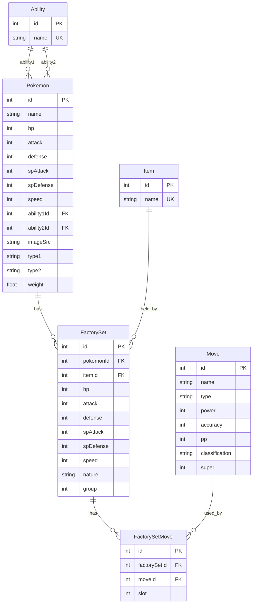

# ER Diagram

今後採用する想定のER図です。`ability` と `item` はマスタ化し、ファクトリー個体の技構成は関連テーブルで管理します。

## Table Roles

- `Ability`: 特性マスタ。`Pokemon` から参照する。
- `Item`: 持ち物マスタ。`FactorySet` から参照する。
- `Pokemon`: 種族データ。種族値、タイプ、特性などの基本情報を持つ。
- `Move`: 技マスタ。
- `FactorySet`: バトルファクトリー用の個体データ。努力値、性格、持ち物、グループを持つ。
- `FactorySetMove`: `FactorySet` と `Move` の関連テーブル。技の並び順を `slot` で保持する。

## Design Notes

- `FactorySet` には `name` を持たせない。表示名は `Pokemon.name` を参照する。
- `Pokemon.ability1Id` は必須、`Pokemon.ability2Id` は任意。
- `FactorySet.itemId` は任意。持ち物なしを許容する。
- `FactorySetMove.slot` は 1-4 を想定し、技の並び順を表す。
- `FactorySetMove` には少なくとも `@@unique([factorySetId, slot])` を付ける。
- 同一技の重複も禁止したいなら `@@unique([factorySetId, moveId])` も追加する。

## Migration Intent

- 既存の `Pokemon.ability1` / `ability2` の文字列保持は、`Ability` 参照へ置き換える。
- 既存の `Factory_Pokemon.item` の文字列保持は、`Item` 参照へ置き換える。
- 既存の `Factory_Pokemon.name` は削除する。
- 既存の `PokemonMove` は `FactorySetMove` に整理し、`slot` を追加する。
